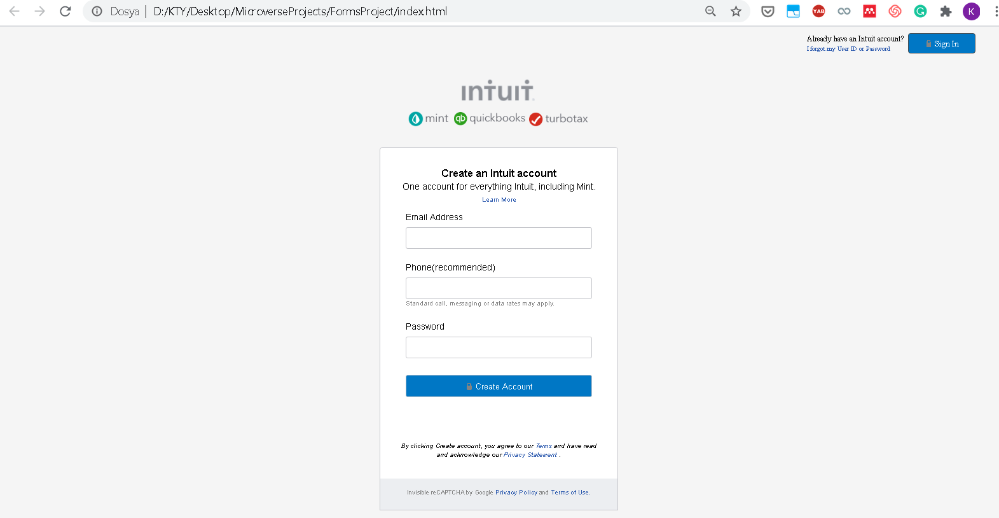

# Project Name

> This is a sign-up form project. The form gets the user's information to create an account.

Additional description about the project and its features.

## Built With

- HTML, CSS

## Live Demo

git@github.com:ktyyctrk/FormsProject.git

## Getting Started

To get a local copy up and running follow these simple example steps.

### Prerequisites
- There is no special prerequisites to run this project locally
- navigate inside by typing cd FormsProject

### Setup
- Clone this repository using git clone git@github.com:ktyyctrk/FormsProject.git
- navigate inside by typing cd FormsProject

### Install
No installation was required

### Usage
open index.html file within your browser

### Run tests
Running a test is not required.

### Deployment

## Authors

👤 **Author1**

- Github: https://github.com/enaburekhan
- Twitter: https://twitter.com/enaburekhaneric
- Linkedin: https://www.linkedin.com/in/eric-enaburekhan-801a28100/

👤 **Author2**

- Github: https://github.com/ktyyctrk
- Twitter: https://twitter.com/ktyyctrk
- Linkedin: https://www.linkedin.com/in/kyuceturk/

## 🤝 Contributing

Contributions, issues and feature requests are welcome!

Feel free to check the [issues page](issues/).

## Show your support

Give a ⭐️ if you like this project!

## Acknowledgments

- Many thanks to Microverse for given my partner and I, the opportunity learn and grow.

## 📝 License

This project is [MIT](lic.url) licensed.
